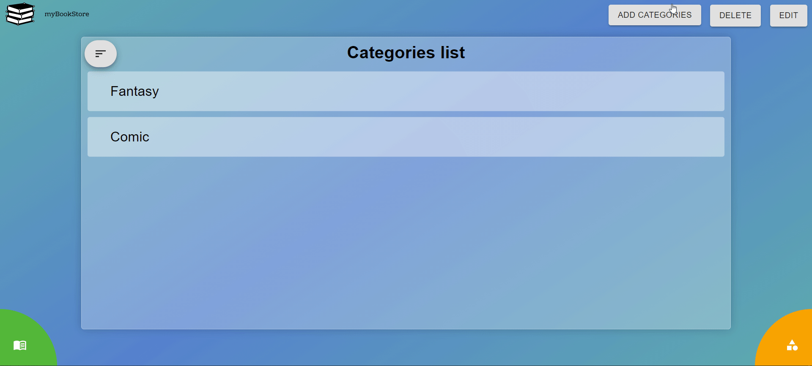
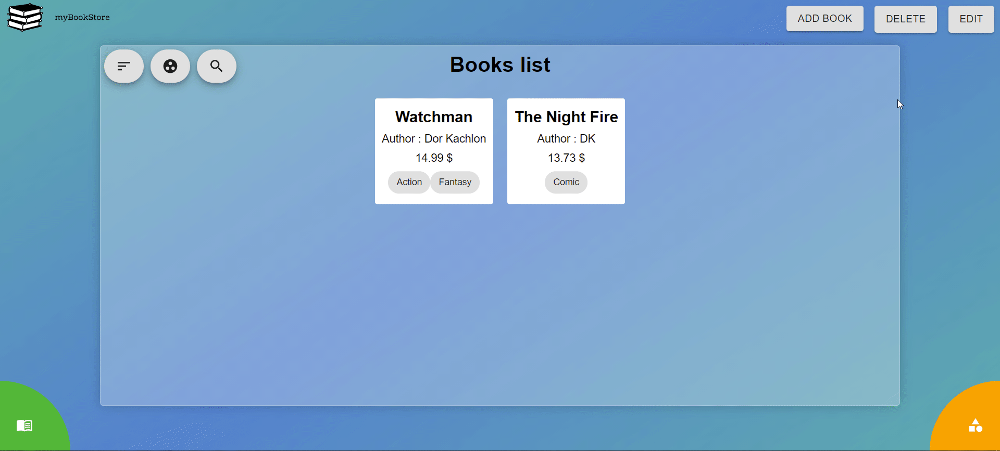
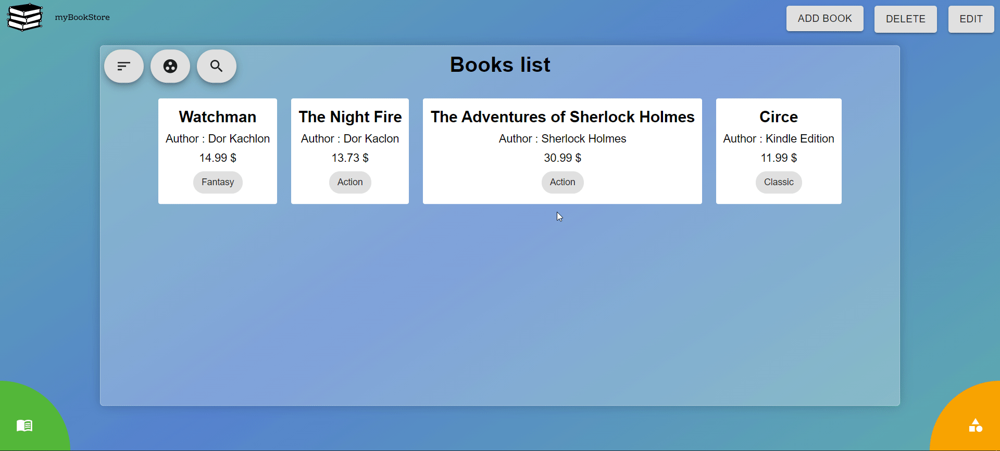
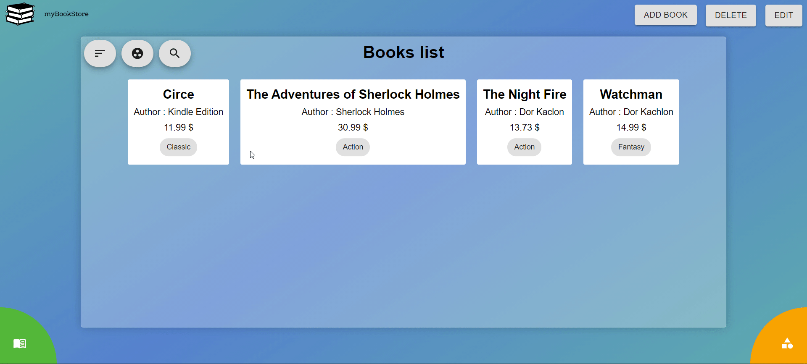

# myBookStore-Application

## Info

`Framework` - React.js ,

`State Manager` - Redux

### Central Libraries :

- react-router-dom
- react-transition-group
- Material-UI
- React-Redux

## DEMO
https://my-book-store-eta.vercel.app/

## Sample Application Description

The sample application is called myBookStore and it allows the user to maintain a list of categorized name books.

All data is saved to the locale storage of the browser .

## Brief introduction to the interface

-Each screen (except the Home page) has a top toolbar with title and action buttons. The user executes an operation on a list item by clicking the appropriate button in the top toolbar.

-The application screen has a bottom bar with two iconic buttons: Categories and Books. The user moves between Categories and Books management by clicking on their respective icons on the bottom button bar.

## Categories

A Category has a single property: Name.

The user can manage (view, add, remove and edit) the list of Categories.

### Add

### Remove & Edit

### To sort

The user can view all Categories sorted by alphabetical order.

## Books

A Book has the following properties: Name, Author, Price, and Category.

The user must fill all properties when saving an item.

The user can manage (view, add, remove and edit) the list of Books.

The user must choose a category from a list of existing categories when defining a Book.

### Add

Allow relating multiple categories to a single item.

### Remove & Edit

### To Sort & Grouped

The user can view all Books sorted by alphabetical order, grouped or ungrouped by category.

### To Search

The user can view only the books assigned to a specific chosen category.

